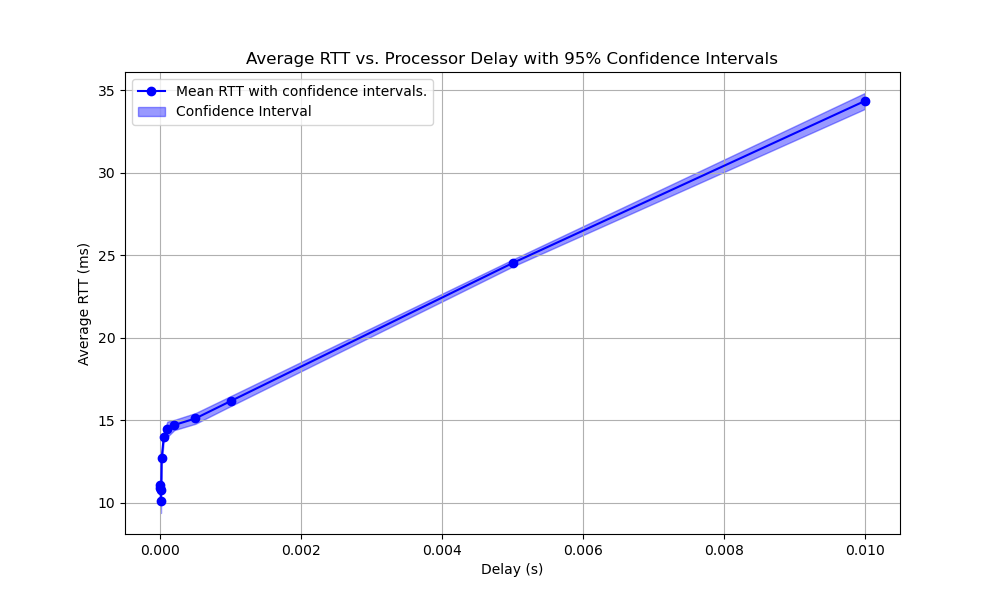
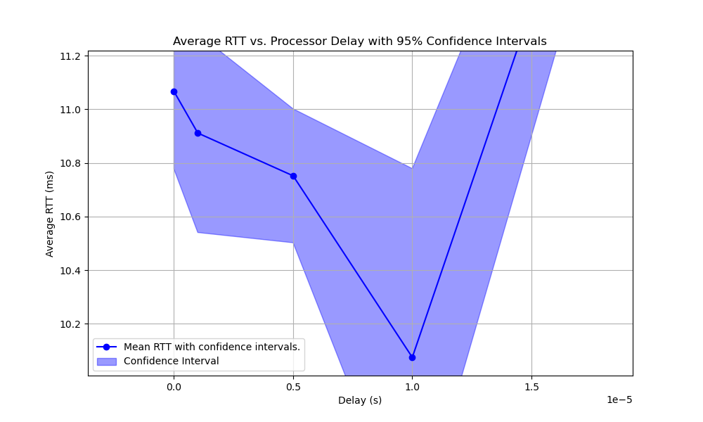

# Phase 1 Report

## NATS Processor
This processor is based on the given python processor example. The main difference is that it declares a class for the processor, to adopt a modular approach. In the upcoming phases it is expected to be easier to extend its functionality through this class, to add the covert channel detection and mitigation functionalities.

The processor samples a random delay value $D$ from a uniform distribution, waits $D$ seconds before publishing the incoming packets. The mean of the uniform distribution is provided by the arguments, ì.e. via  ``phython main.py -d <delay_in_seconds>``.

## Tests
To measure RTT, ``ping`` command is used throughout the bash scripts. To run all the tests ``run_all.sh`` is used after starting the docker containers. A script inside ``sec``, ``/ping_test/ping_test.sh`` is provided to ping the ``insec`` host with $N$ packets. It also has a parameter of $K$ trials, to run the same experiment for $K$ times.

Throughout the experiments $N=100$ and $K=30$ is used, i.e. 100 packets are sent from ``sec`` to ``insec`` for 30 different trials. $K$ trials are conducted in order to calculate a confidence interval as it was suggested for this phase. 

**Figure 1.1**

**Figure 1.2**

The mean values of the uniform distribution used in this experiment are 
0, 1e-6, 5e-6, 10e-6, 20e-6, 50e-6, 100e-6, 200e-6, 500e-6, 1000e-6, 5000e-6, and 10000e-6
seconds. Overall, we see an increasing trend in Figure 1.1, as the mean of the uniform distribution increases, the RTT increases as well. However for the small values of mean, the expectation of linear increase is not realized (see Figure 1.2), where the lowest RTT is achieved around 1e-5 seconds of mean delay. 
